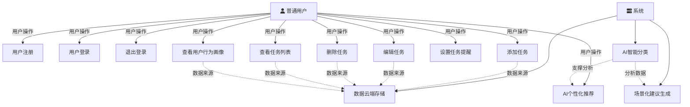

```mermaid
graph TD
    %% 定义参与者（Actor），对应用例图的外部角色，用用户图标
    A[fa:fa-user 普通用户]
    B[fa:fa-server 系统]

    %% 用户直接触发的所有用例（矩形框）
    A -->|用户操作| C[用户注册]
    A -->|用户操作| D[用户登录]
    A -->|用户操作| E[退出登录]
    A -->|用户操作| F[添加任务]
    A -->|用户操作| G[编辑任务]
    A -->|用户操作| H[删除任务]
    A -->|用户操作| I[查看任务列表]
    A -->|用户操作| J[设置任务提醒]
    A -->|用户操作| K[查看用户行为画像]
    A -->|用户操作| L[AI个性化推荐]

    %% 系统内部服务用例，由系统驱动、为用户提供能力
    B --> M[AI智能分类]
    B --> N[场景化建议生成]
    B --> O[数据云端存储]

    %% 用例之间的依赖/调用关系（系统用例支撑用户上层用例）
    M -.->|支撑分析| L
    M -.->|分析数据| N
    F -.->|数据来源| O
    G -.->|数据来源| O
    H -.->|数据来源| O
    I -.->|数据来源| O
    K -.->|数据来源| O
```